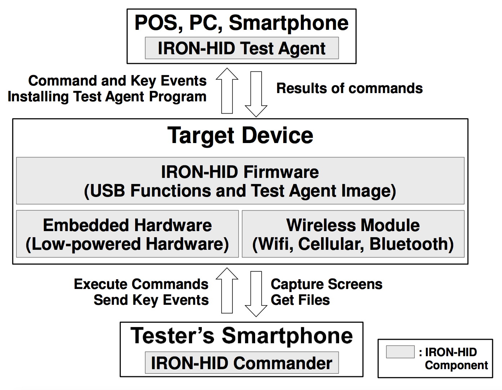

# IRON-HID: Create Your Own Bad USB Device

**You can find my presentation file under the link.**

[HITBSecConf 2016 Amsterdam Conference Agenda](http://conference.hitb.org/hitbsecconf2016ams/sessions/iron-hid-create-your-own-bad-usb-device/)

[HITBSecConf 2016 Amsterdam Papers](http://conference.hitb.org/hitbsecconf2016ams/materials/Whitepapers/Seunghun%20Han%20-%20IRON-HID%20-%20Create%20Your%20Own%20Bad%20USB%20Device.pdf)

[HITBSecConf 2016 Amsterdam Presentation](http://conference.hitb.org/hitbsecconf2016ams/materials/D1T2%20-%20Seunghun%20Han%20-%20Create%20Your%20Own%20Bad%20USB%20Device.pdf)

HITBSecConf 2016 Amsterdam Demo Links:
- [Android phone PIN Brute-force Test](http://youtu.be/rkTEXyGt8bw)
- [Android phone Hidden Menu Test](http://youtu.be/eahTstqfHKs)
- [POS System Test](http://youtu.be/5-a4Nao9gtA)

Although embedded hardware hacking seems to be an out-of-date technique, it is still dangerous and effective.  I created a project called **IRON-HID** – a platform for security validation that can create various types of USB devices such as HID (Human Interface Device) type, mass-storage type, and vendor-specific type. The IRON-HID contains installable software that enables you to gain full control of the target machine. You can then perform whatever actions you want on the target device via an Android smartphone application (IRON-HID Commander application).

I designed the IRON-HID platform for pen-testing using open-source hardware. IRON-HID has many functions including:
- Small form-factor and communicates with an Android application.
- Emulate a CD-ROM, so it can install a trojan without a network connection
- Hook into a user’s keyboard event and send keystrokes to the attacker
- Perform screen captures of the target device
- Receive input from pen-tester via the Android application and send it to the target machine

I created **PowerShock** to show the potential uses of the **IRON-HID** platform. PowerShock looks like a portable charger and works as you would expect. You can charge your smartphone with it and recharge it with PC. However, when you plug it into your Android smartphone or PC, PowerShock will crack your device password or send important information from your PC to an attacker.  I will also show other examples of installing IRON-HID into existing hardware such as USB card readers (ReaderShock) and keyboards (KeyboardShock).

> **Known issue**: IRON-HID firmware cannot use full flash area of custom devices. **It can use only 64KB**, and I am finding the reason. If you solve this issue, please let me know or send **pull-request**.

# Contributions
If you have any idea about IRON-HID, please let me know or send **pull-request**. **I always welcome your any contributions.**

# Architecture of IRON-HID
IRON-HID is a framework comprising custom devices, firmware that operates these custom devices, test agent programs that are installed on the host, and commander programs that are installed on smartphones. 

<center>  </center>

IRON-HID offers keyboard emulation functions that monitor and transmit keyboard entries, and a function that simulates mass storage for installation on the test agent program host (PC, POS, and smartphone). 

It also offers the ability for the security inspector to control these functions using a smartphone. We used several small embedded hardware equipped with several I/O pins to create a custom device so that IRON-HID can be attached to the legacy device. The design was also made so that the functions of IRON-HID can be expanded through the commander program installed on the smartphone and the test agent installed on the host. IRON-HID, with an expandable design and structure, can be used for penetration tests in various environments.


# How to Build IRON-HID Hardware
The hardware part directly connects with the POS, PC, or mobile device through a USB, and is composed of the embedded device that was selected in advance (Arduino Mega, Teensy), the wireless communication module, and the USB On-The-Go (OTG) cable.

The wireless communication module can be selected from Bluetooth, Wi-Fi, or cellular networks. We used the Bluetooth serial communication module (RN-42 silver).

## Boards List
IRON-HID supports Arduino Mega and Teensy board. The detailed specifications for Arduino Mega and Teensy are as follows.
- **Arduino Mega Board**
 - Low power consumption, 60 I/O pin, 256KB flash memory, 10.2 cm x 5.3 cm.
 - Uses ATmega2560 and ATmega16U2 with USB communication functions.
 - Used when the device to be attached to is large, and when many I/O pins are required.
- **Teensy Board**
 - Low power consumption, 46 I/O pin, 128KB flash
memory, 5.08 cm x 1.8 cm.
 - Uses AT90USB1286 with USB communication functions.
 - Can be used on devices of various sizes.
- **RN-42 Silver**
 - Bluetooth module for serial communication

> I recommended you to use Teensy board. Because Arduino Mega board has two microcontrollers, and I should make each firmware for them. It is a little inconvenient than Teensy. In this reason, I develop features using Teensy board first and port them to Arduino.

## How to make hardware
The detailed sequence of making hardware is shown in my HITBSecConf 2016 presentation file.

Please see this file. [IRON-HID Presentation File](http://conference.hitb.org/hitbsecconf2016ams/sessions/iron-hid-create-your-own-bad-usb-device/)

# How to Build IRON-HID Software
IRON-HID is composed of three kinds of software, a firmware for a custom device, a commander program for Android Smartphone, a test agent program for POS systems and PCs.

## Build IRON-HID Firmware and Upload
You download Ubuntu 14.04 LTS 32bit DVD image from Ubuntu official website(http://www.ubuntu.com/download/desktop). After downloading Ubuntu image and installing Ubuntu OS, you open a terminal program and type like this for installing AVR-GCC 4.8.2.

```bash
$>sudo apt-get install gcc-avr binutils-avr gdb-avr avr-libc dfu-programmer avrdude
```

You can download LUFA 100807 version from Dean Camera's site(http://www.fourwalledcubicle.com/LUFA.php). After downloading the **LUFA 100807.zip** file, you open a terminal program and type like this for decompressing zip file.

```bash
$>unzip LUFA-100807.zip
```

The IRON-HID's project consists of many directories. You copy **Firmware-Teensy** and **Firmware-Arduino** directory to the LUFA directory for building firmware. And you build the firmware by typing like this.

```bash
$LUFA 100807> ls -l
drwxr-xr-x  4 user user  4096  8월  8  2010 Bootloaders
drwxr-xr-x  5 user user  4096  3월 28  2014 Demos
drwxr-xr-x  5 user user  4096  5월 11 09:08 Firmware-Teensy
drwxr-xr-x  5 user user  4096  5월 11 09:08 Firmware-Ardino
drwxr-xr-x  7 user user  4096  4월 25 02:41 LUFA
-rwxr-xr-x  1 user user 64553  7월 22  2010 LUFA.pnproj
-rwxr-xr-x  1 user user   793  5월  7  2010 makefile
drwxr-xr-x 13 user user  4096  5월 10  2014 Projects
-rwxr-xr-x  1 user user  2428  7월 29  2010 README.txt

$LUFA 100807> cd Firmware-Teensy or Firmware-Arduino
$LUFA 100807/Firmware-Teensy> make clean
$LUFA 100807/Firmware-Teensy> make
```

If you succeed to build a firmware, you can find the `KeyboardFirmware.hex` file and upload it to Teensy. For uploading it, check the Teensy website, [Teensy Loader](https://www.pjrc.com/teensy/loader.html).

## Build a Test Agent Program
The test agent program is installed in the POS and PC. It runs the commands sent by the firmware and returns the results. When the test agent program is executed, it lists the USB devices that are connected to the host and searches IRON-HID firmware’s Vendor ID (VID) and Product ID (PID).

If a USB device with the same VID and PID is found, a connection channel for the relevant device and the vendor command is created. The USB devices function passively, and the test agent program periodically checks if there is a command from the firmware and returns the execution results.

The test agent program is in **TestAgent** directory, and you can build it Microsoft Visual Studio 6.0(sorry, I am old school programmer). You should build it with release option for reducing the size of **TestAgent.exe** file. If you don't use that option, the file size may be over the flash size of custom boards.

> **Known issue**: IRON-HID firmware cannot use full flash area of custom devices. **It can use only 64KB**, and I am finding the reason. If you solve this issue, please let me know or send **pull-request**.

## Build a CD-ROM Image for Including a Test Agent Program
A test agent program is included in a CD-ROM image, and it is mounted onto a POS system and PC. For making a CD-ROM image, you should copy the **TestAgent.exe** program to **ISO-Builder/CDImage** directory.

The directory has a **autorun.inf** file, and the contents are as follows.
```bash
[autorun]
open=TestAgent.exe
```

After copying, you make a **autorun.iso** image by using UltraISO tool and copy **autorun.iso** file to **ISO-Builder** directory. Then you convert the ISO file to C language format. After creating it, copy contents of **header.h** file to **Firmware-Teensy/Images.h** and **Firmware-Arduino/Keyboard/Images.h** file. Then upload the firmware to the atmega2560 microprocessor for updating new CD-ROM image, and rebuild the IRON-HID firmware.

```bash
$> python ConvertISOtoC.py > header.h
```

## Build a Commander Program for Android
The commander program is made in Android Studio. The source codes are in “Commander” directory and you can import the project by selecting "Open an existing Android Studio Project". After importing it, build “Commander.apk” file by selecting "Build" -> "Make Project" menu. You can install the apk file by selecting "Run" -> "Run Application" menu or sending the file to your smartphone via email.

# How to Use IRON-HID

See under links.

- [Demo Video - Android phone PIN Brute-force Test](http://youtu.be/rkTEXyGt8bw)
- [Demo Video - Android phone Hidden Menu Test](http://youtu.be/eahTstqfHKs)
- [Demo Video - POS System Test](http://youtu.be/5-a4Nao9gtA)

Under construction...

# TODO:
- [ ] Solve the limitation of flash usage(only 64KB).
- [ ] Add file send feature from **commander program** to **test agent program**.
